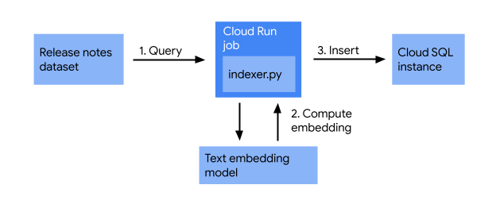
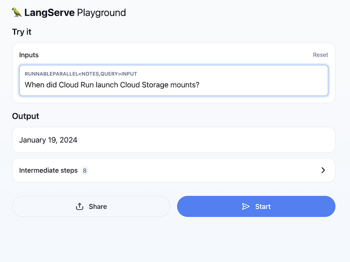

# run-rag4

A Retrieval-Augmented Generation (RAG) application built with LangChain and deployed on Google Cloud Run. This application answers questions about Cloud Run using Google Vertex AI embeddings and a PostgreSQL vector database.

## Overview

This RAG application demonstrates:
- **Vector Storage**: Uses PGVector with PostgreSQL to store and retrieve document embeddings
- **Semantic Search**: Leverages Google Vertex AI embeddings (text-embedding-004) for semantic similarity
- **LLM Integration**: Uses Google Gemini (gemini-1.0-pro-001) to generate contextual answers
- **API Server**: Built with FastAPI and LangServe for easy deployment and integration

## Architecture

The application follows a standard RAG pipeline:
1. **Retrieval**: User queries are embedded and matched against stored documents in the vector database
2. **Augmentation**: Retrieved documents are formatted and combined with the user query
3. **Generation**: The combined context is passed to the Gemini model for answer generation


## Prerequisites

- Python 3.9+
- Google Cloud Account with Vertex AI enabled
- PostgreSQL database with pgvector extension
- Environment variables configured for database and Google Cloud access

## Installation

Enable the APIs
```bash
gcloud services enable \
  bigquery.googleapis.com \
  sqladmin.googleapis.com \
  aiplatform.googleapis.com \
  cloudresourcemanager.googleapis.com \
  artifactregistry.googleapis.com \
  cloudbuild.googleapis.com \
  run.googleapis.com \
  secretmanager.googleapis.com
```

Create the Sql instance
```bash
gcloud sql instances create sql-instance \
  --database-version POSTGRES_14 \
  --tier db-f1-micro \
  --region $REGION
```

Set the environment variables:

```bash
export REGION=us-central1
```

Install required dependencies:

```bash
pipx install langchain-cli poetry

```

## Create a langchain app

```bash
langchain app new
```

## install the app
```bash
poetry install
```

## Configuration

Set the following environment variables before running the application:

```bash
# Database Configuration
export DB_INSTANCE_NAME="your-cloud-sql-instance"
export DB_USER="your-db-user"
export DB_PASS="your-db-password"
export DB_NAME="your-db-name"

# Google Cloud (automatically set when using Application Default Credentials)
export GOOGLE_APPLICATION_CREDENTIALS="/path/to/service-account-key.json"
```

## Usage

## Push to Artifcat Registry 
```bash
cloud builds submit --tag gcr.io/${PROJECT_ID}/run-rag:v1.0 .
```

## Deploy to cloud run
```bash

```

### Local Development

Start the server locally:

```bash
python -m app.server
```

The application will be available at `http://localhost:8000` with interactive API documentation at `http://localhost:8000/docs`

### Making Requests

Send a question to the RAG chain:

```bash
curl -X POST http://localhost:8000/invoke \
  -H "Content-Type: application/json" \
  -d '{"input": "What is Cloud Run?"}'
```

Or use the interactive Swagger UI at `http://localhost:8000/docs`

## Deployment on Google Cloud Run

### Building the Image

Build the Docker image:

```bash
docker build . -t gcr.io/YOUR_PROJECT_ID/run-rag4
```

### Pushing to Container Registry

Push the image to Google Container Registry:

```bash
docker push gcr.io/YOUR_PROJECT_ID/run-rag4
```

### Deploying to Cloud Run

Deploy the application to Cloud Run with necessary environment variables and Cloud SQL connection:

```bash
gcloud run deploy run-rag4 \
  --image gcr.io/YOUR_PROJECT_ID/run-rag4 \
  --platform managed \
  --region us-central1 \
  --set-env-vars DB_INSTANCE_NAME=YOUR_INSTANCE,DB_USER=YOUR_USER,DB_PASS=YOUR_PASS,DB_NAME=YOUR_DB \
  --add-cloudsql-instances YOUR_INSTANCE \
  --memory 2Gi \
  --timeout 3600
```

## Use the prompt
Navigate to /playground and start asking about the cloud run releases.

